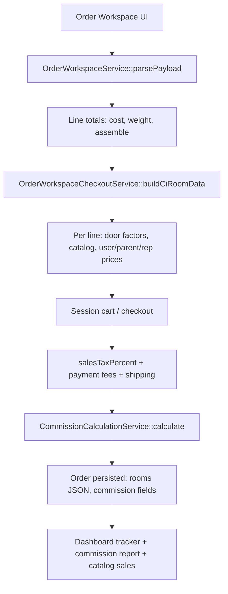

# CI → Laravel Tenant — End-to-End Testing Guide

**Last updated:** May 2026  
**Purpose:** Step-by-step manual testing from first setup module through calculation parity to the **order tracker**, comparing **CodeIgniter Team Cabinets** with the **Laravel multi-tenant** panel.

**Related docs:**

- [CI-vs-Laravel-Tenant-Comparison.md](./CI-vs-Laravel-Tenant-Comparison.md) — modules, services, calculation formulas
- [CI-vs-Laravel-Email-Comparison.md](./CI-vs-Laravel-Email-Comparison.md) — email templates and triggers
- [E2E-Test-Report.md](./E2E-Test-Report.md) — automated `php artisan tenant:e2e-smoke` output

---

## Table of contents

1. [Before you start](#1-before-you-start)
2. [Phase 0 — Foundation setup](#2-phase-0--foundation-setup)
3. [Phase 1 — Module smoke (no math)](#3-phase-1--module-smoke-no-math)
4. [Phase 2 — Single test order (calculation match)](#4-phase-2--single-test-order-calculation-match)
5. [Phase 3 — Commission report](#5-phase-3--commission-report)
6. [Phase 4 — Dashboard catalog sales](#6-phase-4--dashboard-catalog-sales)
7. [Phase 5 — Order tracker](#7-phase-5--order-tracker)
8. [Phase 6 — Related flows (optional)](#8-phase-6--related-flows-optional)
9. [Comparison worksheet](#9-comparison-worksheet)
10. [Known acceptable differences](#10-known-acceptable-differences)
11. [Quick checklist](#11-quick-checklist)

---

## 1. Before you start

| Item | CI | Laravel |
|------|-----|---------|
| Environment | Same DB snapshot or parallel test data | Tenant subdomain (e.g. `your-tenant.your-domain`) |
| Admin login | CI admin account | Tenant **Admin** |
| Browser | — | Hard refresh after deploy (Ctrl+F5) |

### Optional automated baseline (Laravel only)

```bash
cd team-cabinets
php artisan migrate
php artisan db:seed
php artisan tenant:e2e-smoke
```

This verifies provisioning, roles, 27 email templates, commission service callable, tracker-related tables, and routes. It does **not** prove dollar-for-dollar parity with CI — use Phases 2–5 for that.

### Laravel services reference (calculations)

| Area | Service / file |
|------|----------------|
| Line pricing & door factors | `OrderPricingService`, `UserDoorFactorService`, `OrderWorkspaceCheckoutService::buildCiRoomData()` |
| Checkout totals | `OrderWorkspaceCheckoutService`, `OrderWorkspaceShippingService` |
| Sales tax | `SalesTaxCountiesService`, `TaxValuesService` |
| Cart commission | `CommissionCalculationService` (mirrors CI `commCalculation`) |
| Commission report | `CommissionReportService` |
| Catalog sales widget | `CatalogSalesAnalyticsService` |
| Order tracker | `TenantOrderTrackerService`, `TenantDashboardTrackerController` |

---

## 2. Phase 0 — Foundation setup

Complete these **in order** on **both** CI and Laravel using the **same numbers** so later math compares cleanly.

### 0.1 Tenant / site exists

| System | Action |
|--------|--------|
| Laravel | Pinnacle creates tenant OR tenant self-registers → `TenantProvisioningService` seeds roles, taxes, commission defaults, emails |
| CI | Use existing install with equivalent company/site settings |

### 0.2 Settings → Tax & Fees

Match keys on both systems. Laravel: **Settings → Tax & Fees**.

| Key | Example (see `config/team_cabinets_tenant.php`) |
|-----|--------------------------------------------------|
| `sales_tax_percentage` | Fallback % when county lookup unavailable |
| `credit_card_charges` | 3 |
| `debit_card_charges` | 0.50 |
| `ach_pay_charges` | 10.00 |
| `fuel_charges_value` | 2 |
| `commercial_delivery_charge` | 75 |
| `liftgate_charge` | 150 |
| `unload_charge` | 150 |
| `pallet_cost` | 30 |
| `shipping_light_threshold` / surcharges | If testing weight-based shipping add-on |

### 0.3 Settings → Commission & point factors

| Role | Typical default |
|------|-----------------|
| representatives | 0.20 |
| distributors / dealers / showrooms | 0.24 |
| Admin (manufacture) | ~0.165 on **admin user** `point_factor` |

Laravel optional sync:

```bash
php artisan sync:ci-point-factor-defaults
```

### 0.4 Products setup

1. **Product catalog** — active, same name as CI test catalog  
2. **Product section**  
3. **Door style** — linked to catalog  
4. **Products** — same SKU, **cost**, **weight**, **assemble_cost** as CI  

Laravel: **Settings → Products** hub (Vue CRUD) or legacy product screens.

### 0.5 Users & hierarchy

Create the **same tree** on both sides:

| User | Role (`user_type`) | `point_factor` | `parent_id` |
|------|-------------------|----------------|-------------|
| Admin | admin | e.g. 0.165 | — |
| Rep | representatives | 0.20 | Admin |
| Dealer | dealers | 0.24 | Rep |
| Customer | customers | optional | Dealer |

On Laravel also configure:

- **Catalog visibility** (which catalogs appear in Create Order)  
- **Door point factors** (`door_point_factor` JSON) — same decimals as CI per catalog/door  

Laravel: **Users → Create/Edit** → door factor modal.

### 0.6 Sales tax (if testing Florida)

- Taxable user + county → Laravel `SalesTaxCounty` lookup (default 7% if county missing).  
- Non-taxable user → `is_taxable_user` → 0% tax.

**Phase 0 pass:** Admin can open Create Order; dealer sees assigned catalogs/doors; Tax & Fees and commission defaults saved.

---

## 3. Phase 1 — Module smoke (no math)

Walk modules in admin nav order. Confirm screens load and CRUD works on Laravel; note CI equivalent screen.

| # | Module | Laravel | CI (approx.) |
|---|--------|---------|--------------|
| 1 | Dashboard | `tenant_dashboard` | dashboard / dashboard2 |
| 2 | Users | `tenant_user_*` | user_register CRUD |
| 3 | Roles | `tenant_role_*`, `tenant_hierarchy_*` | manage roles |
| 4 | Products | `tenant_products_hub` | products / catalog / sections / doors |
| 5 | Orders list | `tenant_order_list` | my_orders list |
| 6 | Create order | `tenant_order_workspace` | insert_new_order / cart |
| 7 | Quotes | `tenant_quotes_*` | my_quote |
| 8 | Shipping quotes | `tenant_shipping_quotes_*` | shipping quote |
| 9 | Stock check | `tenant_stock_check_*` | stock check |
| 10 | Claims | `tenant_claim_*` | claims |
| 11 | Commission report | `tenant_commission_report_index` | commission report |
| 12 | Settings | `tenant_settings_hub` | Manage_settings |

Non-admin roles: confirm **role layout**, sidebar, and header **Create an order** (when `order-create` permission applies).

**Phase 1 pass:** No 403 for admin; rep/dealer flows reachable; data saves without 500 errors.

---

## 4. Phase 2 — Single test order (calculation match)

Use **one fixed cart** on CI and Laravel. Record every input in the [worksheet](#9-comparison-worksheet).

### 4.1 Build cart (order workspace)

**Login as:** Dealer (or same role as CI test).

1. **Create Order** → select catalog → door style.  
2. Add **2–3 products** with known quantities.  
3. Record per line: SKU, qty, unit cost, user door factor, line total.

**Laravel flow:** `OrderWorkspaceService` → pricing context → line totals.  
**CI flow:** Cart UI before checkout (`insert_new_order` path).

### 4.2 Checkout totals (field by field)

| Field | How to compare |
|-------|----------------|
| Product subtotal | Sum of `cost × qty` |
| Assemble | If assemble = yes: sum `assemble_cost × qty` |
| Shipping | Quote or self-ship; include weight surcharge if applicable |
| Sales tax | County/settings × taxable base |
| Fuel | `fuel_charges_value` % (confirm order of application vs CI) |
| Card / ACH fees | From Tax & Fees |
| **Grand total** | Must match CI to **2 decimal places** |

**Weight surcharge (if applicable):**

- Weight ≤ `shipping_light_threshold` → add `shipping_light_surcharge`  
- Else → add `shipping_heavy_surcharge`  

### 4.3 Cart-level commission (`commCalculation`)

CI input: `all_cart_total[0]` (confirm same base amount in your test).  
Laravel: `CommissionCalculationService::calculate($cartAmount, $user, $affiliateId)`.

| Output | Formula (concept) |
|--------|-------------------|
| `mfgCommission` | `cartAmount × admin.point_factor` |
| `repCommission` | Customer is rep: `cart × user.factor`; else if parent is rep: `cart × parent.factor` |
| `affCommission` | Dealer/affiliate: `cart × parent.factor` (or user if no parent) |
| `sub_aff_commission` | Sub-affiliate when parent is not rep |

**Laravel DB columns:** `mfg_comm`, `rep_comm`, `aff_comm`, `sub_aff_commission`, `rep_id`, `commission_parent_id`.

### 4.4 Persisted room JSON (`room_data` / `rooms`)

Each line should include CI-shaped parallel arrays:

- `user_door_factor[]`, `parent_door_factor[]`, `representative_door_factor[]`  
- `user_door_price[]`, `parent_door_price[]`, `rep_door_price[]`  
- `product_actual_price[]`, `product_quantity[]`, `sel_catalogue_name[]`  

Laravel: `orders.rooms` via `buildCiRoomData()`.

**Pass:** Same line count, factors, and extended prices (±$0.01 rounding).

### 4.5 Complete the order

| System | Completed flag |
|--------|----------------|
| CI | `my_orders.state = 1` |
| Laravel | `orders.state = 1` |

Only completed orders feed commission report, catalog sales widget, and tracker order rows.

**Phase 2 pass:** Grand total + commission fields + room JSON match CI for the test cart.

---

## 5. Phase 3 — Commission report

**Prerequisite:** Phase 2 order completed (`state = 1`).

1. **CI:** Open commission report — same date range and rep/parent filters as Laravel.  
2. **Laravel:** **Commission Report** (`tenant_commission_report_index`). Default weekly range: last Thursday → Wednesday (`CommissionReportService::defaultWeeklyRange()`).

Per **door style** row compare:

| Column | Logic |
|--------|--------|
| User door price | Σ `actual × qty × user_door_factor` |
| Aff commission | `user_door_price − parent_door_price` |
| Rep commission | `parent_door_price − rep_door_price` |
| N/A | When parent factor/price is zero |

Export CSV on both sides and spot-check one door style row.

**Phase 3 pass:** Door style names and commission columns match for the test order(s).

---

## 6. Phase 4 — Dashboard catalog sales (dashboard2)

### Known differences (document, do not treat as regression unless product-line totals differ)

| Topic | CI | Laravel |
|-------|-----|---------|
| Time periods | **Previous** quarter / month / week (SQL) | **Current** period start → now |
| Misc charges | Tax, shipping, fees allocated to first catalog line per order | **Product line revenue only** — no misc allocation |

### Test procedure

1. Place 1–2 **completed** orders with products in **Catalog A** and **Catalog B**.  
2. **CI:** `dashboard2` — totals per catalog per period.  
3. **Laravel:** Dashboard catalog sales widget / `tenant_dashboard_catalog_sales` (`CatalogSalesAnalyticsService`).

**Pass (realistic):** Per-catalog **line** totals (`cost × qty` or `product_tot_price`) match; full widget total may differ if CI includes misc allocation.

---

## 7. Phase 5 — Order tracker

**Where:** Admin **Dashboard** → order tracker table (`resources/views/tenants/dashboard/partials/order-tracker.blade.php`).

### 5.1 Row appears

| Record type | Display |
|-------------|---------|
| Order | `#123` |
| Quote | `Quote #id` |
| Stock check | `SC#id` |

Data source: `TenantOrderTrackerService::trackerRows()` (orders, quotes, stock checks + `order_enhanced_details`).

### 5.2 Tracker margin

Laravel margin (simplified):

```
margin = sub_total − (tax + shipping + card/ACH + fuel + assemble + misc + delivery)
```

Display: green if margin % ≥ 20%, else red (`calculateMargin()`).

Compare with CI tracker for the same order: `sub_total`, tax, shipping, fuel, assemble, card fees.

### 5.3 Edit tracker fields

Admin edits vendor, customer paid, stock check status, shipping, etc.

- **Laravel route:** `POST tenant_dashboard_order_tracker_update`  
- **Controller:** `TenantDashboardTrackerController::update`  
- **Storage:** `order_enhanced_details` table  

Stock check status labels: `config/order_tracker.php` → `stock_check_statuses`.

### 5.4 Stock check lifecycle in tracker

1. User submits stock check → row appears; admin notification.  
2. Admin updates shipping on stock check → `update_stock_check_req_to_admin` email; tracker fields update.  
3. Admin approves → user email; status dropdown updated.

### 5.5 Unviewed highlighting

New orders/quotes/stock checks show as unviewed until admin views record or marks viewed (`tenant_dashboard_order_tracker_viewed`).

**Phase 5 pass:** Same order IDs in tracker; edits persist; margin aligns with CI for same inputs.

---

## 8. Phase 6 — Related flows (optional)

| Flow | What to verify |
|------|----------------|
| Quote saved | Line totals; emails to user/admin |
| Shipping quote | Shipping cost in email partial |
| Stock check submit | Admin + user emails |
| Warehouse pick list | Print UI (`tenant_order_pick_list`); warehouse email uses invoice partial (not CI pick-list HTML) |
| Claim | Claim tied to order; admin/user emails |
| Contact form | `contact_us` managed template to admin |
| Order status email | Change `orders.status` → `order_status_to_user` (if column exists) |
| Affiliate create | Parent creates child → `affiliate_register_to_user` |

See [CI-vs-Laravel-Email-Comparison.md](./CI-vs-Laravel-Email-Comparison.md) for full email slug list.

---

## 9. Comparison worksheet

Copy and fill **CI** vs **Laravel (LV)** for one order:

```
Date: _______________
Tester: _______________
CI URL: _______________
Laravel tenant: _______________

Job name: _______________
Ordering user: _______________  Role: _______________
Catalog / door: _______________

Line 1 SKU ___ qty ___ cost ___ user_factor ___ line_total  CI ___  LV ___
Line 2 SKU ___ qty ___ cost ___ user_factor ___ line_total  CI ___  LV ___
Line 3 SKU ___ qty ___ cost ___ user_factor ___ line_total  CI ___  LV ___

Subtotal (products):     CI ___  LV ___
Assemble:                CI ___  LV ___
Shipping:                CI ___  LV ___
Sales tax:               CI ___  LV ___
Fuel:                    CI ___  LV ___
Card / ACH fee:          CI ___  LV ___
GRAND TOTAL:             CI ___  LV ___

mfg_comm:                CI ___  LV ___
rep_comm:                CI ___  LV ___
aff_comm:                CI ___  LV ___
sub_aff_commission:      CI ___  LV ___

Commission report — door style: _______________
  User door price:       CI ___  LV ___
  Aff commission:        CI ___  LV ___
  Rep commission:        CI ___  LV ___

Catalog sales — Catalog A (line total):  CI ___  LV ___
Tracker — sub_total:     CI ___  LV ___
Tracker — margin:        CI ___  LV ___
Tracker — stock status:  CI ___  LV ___

Notes / acceptable diffs: _______________________________________________
```

---

## 10. Known acceptable differences

Do **not** fail the migration for these unless product requirements change:

| Area | CI | Laravel |
|------|-----|---------|
| Dashboard2 periods | Previous quarter/month/week | Current period → now |
| Dashboard2 misc | Order-level fees allocated to catalog buckets | Line revenue only |
| Forgot password | Plain password in email | Reset link (`reset_password_link`) |
| Permissions | Session role checks | Spatie `module-action` permissions |
| Multi-tenant | Single DB per install | Shared DB + `tenant_id` / Stancl context |
| Warehouse email body | Pick list HTML in email | Invoice-style workspace partial |
| Admin file uploads | Primarily `manage_document` | Also `admin_uploads` table |

Full gap list: [CI-vs-Laravel-Tenant-Comparison.md §8](./CI-vs-Laravel-Tenant-Comparison.md#8-parity-gaps--differences).

---

## 11. Quick checklist

| Step | Done |
|------|:----:|
| Tax & fees match CI config | ☐ |
| Role defaults + admin `point_factor` set | ☐ |
| Products/catalog/door/SKU match CI | ☐ |
| Dealer door factors + catalog visibility set | ☐ |
| Phase 1 — all modules load | ☐ |
| One order — grand total matches | ☐ |
| One order — commission fields match | ☐ |
| One order — `rooms` JSON / factors match | ☐ |
| Order completed (`state = 1`) | ☐ |
| Commission report door line matches | ☐ |
| Tracker shows order + margin sane | ☐ |
| Catalog sales line totals noted (period diff OK) | ☐ |

---

## Appendix — Checkout pipeline (Laravel)



**CI equivalent:** `insert_new_order` → cart → `cart_checkout_product` → `order_data_insert` with `room_data` and `commCalculation()`.

---

*End of testing guide.*
