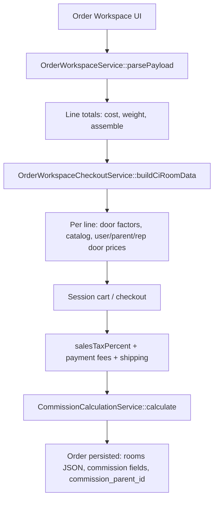

# CodeIgniter vs Laravel Tenant — Feature & Calculation Comparison

**Last updated:** May 2026  
**CI reference:** `ci-team-cabinets/app/Controllers/Admin.php`, `Manage_settings.php`  
**Laravel reference:** `team-cabinets/` (Stancl tenancy, Spatie permissions, Vue CRUD)

This document maps each tenant panel module, settings screen, and **calculation / flow** from the legacy CI app to the Laravel multi-tenant implementation.

**Step-by-step testing (setup → calculations → tracker):** see [CI-Laravel-E2E-Testing-Guide.md](./CI-Laravel-E2E-Testing-Guide.md).

---

## Table of contents

1. [Architecture overview](#1-architecture-overview)
2. [Roles & permissions](#2-roles--permissions)
3. [Admin navigation (frontend)](#3-admin-navigation-frontend)
4. [Settings sidebar (frontend)](#4-settings-sidebar-frontend)
5. [Module-by-module comparison](#5-module-by-module-comparison)
6. [Calculation & checkout flows](#6-calculation--checkout-flows)
7. [Data storage conventions](#7-data-storage-conventions)
8. [Parity gaps & differences](#8-parity-gaps--differences)

---

## 1. Architecture overview

| Aspect | CodeIgniter (CI) | Laravel tenant |
|--------|------------------|----------------|
| App structure | Single `Admin.php` controller (10k+ lines) + `Manage_settings.php` | Controllers + `app/Services/*` |
| Auth | `$_SESSION['logged_in']` (userid, role, point_factor, parent_id) | Laravel session + `TenantAuthSessionService` (CI-compatible keys) |
| Roles | `user_register.user_type` string | Spatie roles **and** `users.user_type` / `getCiRole()` |
| DB | One database per deployment | Central DB + **per-tenant** DB (Stancl) |
| Admin UI | PHP views + jQuery | Blade + Vue 3 (`product-setup-vue-crud.js`) + Alpine on dashboard |
| Routes | `admin/method` segments | Named routes in `routes/tenant.php` (`tenant_*`) |
| Files | `public/assets/...` | Same paths where possible (`tenant_static_asset()`) |

---

## 2. Roles & permissions

### CI roles (`user_type`)

Typical values: `admin`, `representatives`, `distributors`, `dealers`, `showrooms`, `affiliate`, `sub-affiliate`, `customers`.

Session stores: `role`, `point_factor`, `parent_id`, `userid`.

### Laravel roles

| CI | Laravel |
|----|---------|
| `user_type` column | `users.user_type` synced via `User::assignCiRole()` |
| Role checks in views | Spatie `hasRole()` + helpers `tenant_user_is_panel_admin()`, `User::isAdmin()`, `getCiRole()` |
| Permission strings | `config/tenant_permissions.php` — `module-action` (e.g. `order-list`) |
| Default role perms | Seeded in `PermissionTableSeeder` from `default_role_permissions` |

**Service:** `TenantRoleService::DEFAULT_ROLES`, `ensureDefaultRoles()`, protected system roles (no delete in UI).

---

## 3. Admin navigation (frontend)

Configured in `config/tenant_admin_nav.php`. User order stored in `user_nav_menu_orders`.

| Nav item | CI (approx.) | Laravel route(s) | Status |
|----------|--------------|-------------------|--------|
| Dashboard | `teamcabinets_dashboard` / `dashboard2` | `tenant_dashboard` | Partial — see Dashboard |
| Users | user CRUD in Admin | `tenant_user_*` | Migrated |
| Roles | manage roles | `tenant_role_*`, `tenant_hierarchy_*` | Migrated + hierarchy |
| Products | product/catalog/section | `tenant_products_hub`, product-setup API | Migrated |
| Orders | orders list, workspace | `tenant_order_*`, workspace checkout | Migrated |
| Quotes | quotes + shipping quotes | `tenant_quotes_*`, `tenant_shipping_quotes_*` | Migrated |
| Stock check | stock check requests | `tenant_stock_check_*` | Migrated |
| Claims | claims | `tenant_claim_*` | Migrated |
| Bulletins | bulletins | `tenant_bulletin_*` | Migrated |
| Support chat | — | `tenant_support_chat_*` | Laravel feature |
| Settings | manage settings hub | `tenant_settings_hub` | Migrated |

Rep/minor-role nav uses `layouts.tenant.role.master` with downloads/uploads/order help.

---

## 4. Settings sidebar (frontend)

Configured in `config/tenant_settings_menu.php` (`panel_admin_only` hides items from non-admins).

| Settings label | CI | Laravel route | Backend |
|----------------|-----|---------------|---------|
| My Profile | profile edit | `tenant_setting_profile` | `TenantSettingController` |
| Menu Layout | — | `tenant_nav_menu_edit` | Custom nav order |
| Site Settings | site config | `tenant_site_setting` | Site settings store |
| Website Designing | homepage, pages, theme | `tenant_website_designing`, `tenant_frontend_theme`, pages CRUD | `Manage_settings` parity via storefront services |
| Tax & Fees | tax/shipping/payment | `tenant_setting_tax_fees_*` | `TaxValuesService`, `TenantSettingController` |
| Sales Tax Management | county tax | `tenant_setting_tax_fees_sales_tax` | `SalesTaxCountiesService` |
| Commission & Point Factors | commission defaults | `tenant_setting_commission` | `PointFactorDefaultsService`, `UserDoorFactorService` |
| QuickBooks | QB connect | `tenant_quickbooks_*` | `QuickBooksOAuthService` |
| Roles & Permissions | — | `tenant_role_index` | Spatie |
| Email Settings | SMTP + templates | `tenant_setting_email_settings` | `EmailSettingsApiController` |
| Success / Error Messages | flash messages CRUD | `tenant_setting_manage_success_list` | Settings lists |
| **Documentation** | `admin_manage_document` | `tenant_setting_manage_documentation_list` | `ManageDocumentApiController` + Vue CRUD |
| **Admin File Uploads** | (see note below) | `tenant_admin_uploads_index` | `AdminUploadApiController` |
| **Inventory Admin** | `manage_inventory_list` | `tenant_inventory_admin_index` | `InventoryAdminApiController` |

**Note — Admin file uploads:** CI rep downloads in `teamcabinets/list_downloads.php` use table **`manage_document`** filtered by `user_type` (`get_upload_document1`). Laravel keeps that and adds table **`admin_uploads`** for admin-published files with `user_type` visibility (Prompt 6). Both appear on **My Downloads**.

---

## 5. Module-by-module comparison

### 5.1 Dashboard

| Feature | CI | Laravel |
|---------|-----|---------|
| Admin home | Dashboard + bulletins | `tenant_dashboard` — widgets, recent orders, order tracker |
| Catalog sales (dashboard2) | `Admin::dashboard2()` — Total / Last Quarter / Last Month / Last Week by catalog; uses `room_data`, `getCatalogueName()`, includes misc charges per order | `CatalogSalesAnalyticsService` + widget on dashboard; route `tenant_dashboard_catalog_sales`; uses `orders.rooms` (JSON), `state = 1` |
| Order tracker | CI order edit tracker | `TenantOrderTrackerService`, partial on dashboard |

**Dashboard2 calculation difference (important):**

- **CI:** For each order, allocates `tax + shipping + assemble + card fees + ACH + debit` as **Misc** to first line of each catalog in that order; line total uses `product_cost × qty`; catalog name from DB lookup on `product_id` + SKU.
- **Laravel:** Sums **line totals** from `rooms` only (`product_tot_price` or `product_actual_price × qty`); catalog from `sel_catalogue_name[]` in CI-shaped JSON or `catalog_name` in modern shape; **does not** allocate order-level misc charges to catalogs.
- **CI periods:** “Last quarter/month/week” = **previous** calendar period in SQL.
- **Laravel periods:** Quarter/month/week = **current** period start → now (aligned with prompt spec, not identical to CI SQL).

---

### 5.2 Users

| CI | Laravel |
|----|---------|
| `user_register` CRUD | `TenantUserController`, `users` table |
| Import/export | `tenant_user_*` import routes |
| Verification | verified flag | Same concept on user list filters |
| `parent_id` hierarchy | `HierarchyService`, `tenant_hierarchy_*` |

---

### 5.3 Products & catalog

| CI | Laravel |
|----|---------|
| Products, catalogs, sections, door colors | `ProductSetupApiController`, `tenant_products_hub`, Vue CRUD |
| Deactivate all products | CI admin action | `ProductSetupApiController::deactivateAll()` |
| Point factors per catalog/door | User JSON / tables | `UserDoorFactorService`, `OrderPricingService` |

---

### 5.4 Orders & workspace

| CI | Laravel |
|----|---------|
| Multi-step order (`insert_new_order`, cart) | Order workspace (`tenant_order_workspace`) |
| `room_data` POST JSON | `orders.rooms` (array cast) + `buildCiRoomData()` |
| `order_data_insert` | `TenantCreateOrderController` checkout |
| Pick list | CI warehouse pick | `WarehousePickListService`, `tenant_order_pick_*` |
| Export CSV | CI export | `TenantOrderController::exportCsv()` |

---

### 5.5 Quotes & shipping quotes

| CI | Laravel |
|----|---------|
| `my_quote` | Quotes module + `QuoteWorkspaceService` |
| Shipping quote flow | `TenantShippingQuoteController`, `ShippingQuoteAdminViewService` |

---

### 5.6 Stock check

| CI | Laravel |
|----|---------|
| Stock check requests | `TenantStockCheckController`, `StockCheckAdminViewService` |
| Room payload | `room_data` / rooms JSON | Same normalization as orders |

---

### 5.7 Claims

| CI | Laravel |
|----|---------|
| Claims on orders | `TenantClaimController`, `ClaimWorkspaceService`, `claims_order` table |

---

### 5.8 Commission reporting (admin)

| CI | Laravel |
|----|---------|
| Commission report by door style | `commission_report_*` views | `CommissionReportService`, `TenantCommissionReportController` |
| Saving report / CSV | `admin_saving_report` | `tenant_commission_report_*`, saving report routes |
| Weekly default range | Last Thu → Wed | `CommissionReportService::defaultWeeklyRange()` |
| Grouping | By door style, margin columns, N/A when factors zero | Same logic in `doorLinesForOrder()` |

---

### 5.9 Documentation (`manage_document`)

| Field / behavior | CI | Laravel |
|------------------|-----|---------|
| Table | `manage_document` | Same |
| Columns | `user_type`, `document_name` | + `status`, `timestamps`, `deleted_at` |
| Storage | `assets/admin/manage_document/` | Same |
| Admin CRUD | `insert_manage_document`, `edit_manage_document` | Vue CRUD + `ManageDocumentApiController` |
| User download | Filter `user_type IN ('all', role, …)` | `tenant_manage_document_types_for_user()` + **My Downloads** |

---

### 5.10 Admin file uploads (`admin_uploads`)

| CI | Laravel |
|----|---------|
| Separate admin upload table in live CI for role-based files is **not** clearly separate from `manage_document` in `list_downloads.php` | New table `admin_uploads` + `assets/admin_uploads/` |
| — | Settings → Admin File Uploads; filtered on My Downloads by `getCiRole()` or empty `user_type` |

---

### 5.11 User uploads (rep)

| CI | Laravel |
|----|---------|
| `user_uploads` table, `list_upload_file`, `upload_file_insert` | `UserUploadApiController`, `tenant_uploads_index` |
| Path | `assets/user_uploads` | Same |

---

### 5.12 Inventory admin

| CI | Laravel |
|----|---------|
| `manage_inventory_list` — name, SKU, qty, image, pagination | `manage_inventories` — name, SKU, qty, status (no image in Laravel migration) |
| `assets/admin/inventory_img/` | Vue CRUD only (no image field yet) |

---

### 5.13 Tax, fees, shipping settings

| Setting | CI | Laravel |
|---------|-----|---------|
| Sales tax by FL county | `taxcal()` | `OrderWorkspaceCheckoutService::salesTaxPercent()` + `sales_tax_counties` |
| Payment fees (CC/ACH/debit) | site_config / tax settings | `TaxValuesService`, payment fee keys on checkout |
| Shipping light/heavy weight surcharge | checkout logic | `weightShippingSurcharge()`, keys: `shipping_light_threshold`, `shipping_light_surcharge`, `shipping_heavy_surcharge` |
| Fuel charge | fuel % on orders | Dashboard tracker + order fields |
| Assemble cabinetry charge | per order | Workspace totals |

---

### 5.14 Email, QuickBooks, storefront

| Area | CI | Laravel |
|------|-----|---------|
| SMTP | manage_stmp | `EmailSettingsApiController` |
| Email content templates | manage_email_content | Same API hub |
| QuickBooks invoice | QB fields on orders | `TenantQuickBooksController` |
| Public site / homepage | `Manage_settings.php` | `StorefrontPageService`, themes, `tenant_website_designing` |

---

## 6. Calculation & checkout flows

### 6.1 Order checkout pipeline (Laravel)

**CI equivalent:** `insert_new_order` → cart → `cart_checkout_product` → `order_data_insert` with POSTed `user_door_factor*`, `room_data`, `commCalculation()` on cart total.

---

### 6.2 Door factor & line pricing

**Purpose:** Each product line gets catalog-specific pricing multipliers for customer, parent, and representative.

| Step | CI | Laravel |
|------|-----|---------|
| Factor source | User `point_factor`, parent chain, rep | `OrderPricingService::contextFor($user, $catalogId, $doorId)` or `getDoorFactor()` fallback |
| Stored on order | POST arrays per line in `room_data` | `buildCiRoomData()` writes parallel arrays: `user_door_factor[]`, `parent_door_factor[]`, `representative_door_factor[]`, `user_door_price[]`, etc. |
| Unit price | `product_actual_price × qty × user_door_factor` (report) | Same in `CommissionReportService` |
| Catalog name on line | `sel_catalogue_name[]` | Set in `buildCiRoomData()` from pricing context |

**Services:** `UserDoorFactorService`, `OrderPricingService`, `OrderWorkspaceCheckoutService::getDoorFactor()`.

---

### 6.3 Cart-level commission (`commCalculation`)

**CI:** `Admin::commCalculation()` — input `all_cart_total[0]`, optional `affiliate_id`; uses `point_factor` on user, parent, admin.

**Laravel:** `CommissionCalculationService::calculate($cartAmount, $orderingUser, $affiliateId)`.

| Output key | Formula (concept) |
|------------|-------------------|
| `mgfCommission` | `cartAmount × admin.point_factor` |
| `repCommission` | If customer is `representatives`: `cartAmount × user.point_factor`; else if parent is rep: `cartAmount × parent.point_factor` |
| `affCommission` | Affiliate/dealer path: `cartAmount × parent.point_factor` or user if no parent |
| `sub_aff_commission` | Sub-affiliate: `cartAmount × user.point_factor` when parent is not rep |
| `repId` | Parent id when parent type is representatives |

**On checkout:** `TenantCreateOrderController` persists commission fields + `commission_parent_id` (migration `2026_05_31_100004`).

**Gross sales:** `ManageCommission` increment on completed order (Prompt 2).

---

### 6.4 Commission report (door-style rollup)

**CI:** Report views loop orders, group by `product_cabinets_color` (door style).

**Laravel:** `CommissionReportService::formattedData()`:

1. Load orders (`state = 1`, date/rep/parent filters).
2. `flattenCiRoomProducts()` — supports CI map (`product_sku[]`) or modern `rooms[].products[]`.
3. `doorLinesForOrder()` — aggregate per door style:
   - `user_door_price` += `actual × qty × user_door_factor`
   - `aff_commission` = `user_door_price − parent_door_price`
   - `rep_commission` = `parent_door_price − rep_door_price`
   - Display **N/A** when parent factor/price zero (affiliate line).

**Export:** CSV + saving report routes (`tenant_commission_report_*`).

---

### 6.5 Sales tax

| Case | CI | Laravel |
|------|-----|---------|
| Taxable user flag | exempt | `is_taxable_user` → 0% |
| Florida | County lookup | `SalesTaxCounty` by `county_name`, default 7% |
| Other states | site_config rate | `TaxValuesService` / site settings |

---

### 6.6 Payment processing fees

Computed at checkout from configured percentages/flat fees:

- Credit card, debit card, ACH, cash/wire paths.
- **Service:** `OrderWorkspaceCheckoutService` payment fee helpers (uses `TaxValuesService`).

---

### 6.7 Shipping & weight surcharge

| Step | CI | Laravel |
|------|-----|---------|
| Base shipping | Carrier / quote arrays in session | `OrderWorkspaceShippingService`, shipping quote module |
| Weight surcharge | Threshold-based add-on | `weightShippingSurcharge($cartWeight)` — if weight ≤ `shipping_light_threshold` add `shipping_light_surcharge`, else `shipping_heavy_surcharge` |
| Applied total | Added to shipping cost | `applyWeightShippingSurcharge()` on checkout and shipping quote admin view |

Configure in **Settings → Tax & Fees → Shipping** (`manage_tax_fees_shipping.blade.php`).

---

### 6.8 Catalog sales analytics (dashboard2)

**CI `dashboard2()` algorithm (simplified):**

1. Load all catalogs from `catalogues.name`.
2. For each time bucket (total, last quarter, last month, last week), load `my_orders` with `room_data`.
3. For each order, decode rooms; for each line, resolve catalog via `getCatalogueName(product_id, sku)`.
4. Add `cost × qty` to catalog bucket; attach misc charges once per order per catalog.

**Laravel `CatalogSalesAnalyticsService`:**

1. `Order::where('state', 1)` per period.
2. Parse `rooms` — CI map or modern normalized.
3. Catalog key: `sel_catalogue_name[i]` or `catalog_name` on product.
4. Amount: `product_tot_price` or `product_actual_price × qty`.
5. Return JSON: `{ total: {Catalog: amount}, quarter: {...}, month: {...}, week: {...} }`.

---

### 6.9 Warehouse pick list

| CI | Laravel |
|----|---------|
| Pick list print | `WarehousePickListService` — reads `rooms`, picked flags on order |
| Fields | `picked_at`, `picked_by` (migration `2026_05_31_100005`) |

---

## 7. Data storage conventions

| Data | CI column / table | Laravel |
|------|-------------------|---------|
| Room lines | `my_orders.room_data` (JSON string) | `orders.rooms` (JSON array cast) |
| Completed order | `state = 1` | `orders.state = 1`, scope `completed()` |
| Job name | string or JSON | array cast on `job_name` where applicable |
| User role | `user_register.user_type` | `users.user_type` + Spatie role name |
| Point factor | `point_factor` on user | `users.point_factor` |
| Parent | `parent_id` | `users.parent_id`, `commission_parent_id` on order |
| Static files | `assets/...` | Same under tenant `public/` / `tenant_static_asset()` |

---

## 8. Parity gaps & differences

| Area | Status | Notes |
|------|--------|-------|
| Dashboard2 misc charge allocation | **Different** | Laravel catalog widget is product-line revenue only |
| Dashboard2 period definitions | **Different** | CI uses previous quarter/month/week SQL |
| `admin_uploads` table | **Laravel extension** | CI downloads primarily use `manage_document`; Laravel adds separate admin uploads |
| Inventory images | **Partial** | CI had `inventory_img`; Laravel CRUD has no image column yet |
| Manage document `title`/`role` | **N/A** | Laravel uses CI columns `user_type` + `document_name` |
| Single `Admin.php` | **Refactored** | Logic split across services — easier to test |
| Permissions | **Stricter** | Spatie module permissions vs CI session role checks only |
| Multi-tenant | **New** | Each tenant isolated DB; CI was single-tenant per install |

### Prompt migration batches (reference)

| Prompt | Topics |
|--------|--------|
| 1 | CI roles → Spatie, `user_type`, session parity |
| 2 | Order-time `commCalculation`, `commission_parent_id` |
| 3 | Commission reporting & saving report |
| 4 | User hierarchy & CSV exports |
| 5 | Pick list, order CSV, weight shipping, deactivate all products |
| 6 | Admin uploads, manage document CRUD, inventory admin, dashboard2 widget |

---

## Quick route index (Laravel tenant)

| Feature | Route name |
|---------|------------|
| Dashboard | `tenant_dashboard` |
| Catalog sales API | `tenant_dashboard_catalog_sales` |
| Orders workspace | `tenant_order_workspace` |
| Commission report | `tenant_commission_report_index` |
| Hierarchy | `tenant_hierarchy_index` |
| My downloads | `tenant_downloads_index` |
| My uploads | `tenant_uploads_index` |
| Documentation admin | `tenant_setting_manage_documentation_list` |
| Admin file uploads | `tenant_admin_uploads_index` |
| Inventory admin | `tenant_inventory_admin_index` |
| Settings hub | `tenant_settings_hub` |

---

## Files to read when debugging calculations

| Topic | Laravel file |
|-------|----------------|
| Checkout & room JSON | `app/Services/OrderWorkspaceCheckoutService.php` |
| Cart totals | `app/Services/OrderWorkspaceService.php` |
| Cart commission | `app/Services/CommissionCalculationService.php` |
| Door-style report | `app/Services/CommissionReportService.php` |
| Catalog dashboard | `app/Services/CatalogSalesAnalyticsService.php` |
| Door factors | `app/Services/UserDoorFactorService.php`, `OrderPricingService.php` |
| Tax & fees | `app/Services/TaxValuesService.php` |
| CI reference | `ci-team-cabinets/app/Controllers/Admin.php` |

---

*For interactive gap tracking, see also any internal `CI-vs-Laravel-Feature-Gap-Analysis` artifacts in `docs/`.*
